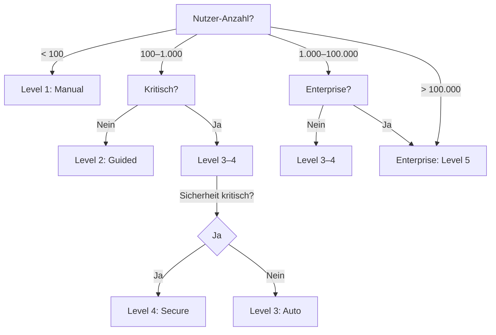

# 02 Maturity-Levels für Update-Systeme

## Überblick

Ein Update-System kann auf fünf verschiedenen Reifegrad-Levels implementiert werden. Jeder Level bringt mehr Automatisierung, Sicherheit und Benutzerfreundlichkeit — kostet aber auch mehr Entwicklungszeit und Infrastruktur.

Dieses Kapitel hilft dir, den **richtigen Level für dein Projekt** zu wählen.

## Level 1: Manual Notice

### Beschreibung

Der Nutzer muss **aktiv überprüfen**, ob eine neue Version verfügbar ist. Die App zeigt nur eine Nachricht an, z. B. "Neue Version 2.1 verfügbar" mit Link zur Download-Seite.

### Merkmale

- App hat **keine automatische Update-Logik**
- Nutzer muss manuell auf GitHub/Website prüfen
- Oder: App zeigt Dialog mit Link zu Download-Seite
- Kein Update-Manifest erforderlich
- Keine Signierung nötig

### Implementierung (Pseudo-Code)

```javascript
// Minimal: Nur Info-Dialog anzeigen
if (userClicksCheckForUpdates) {
  dialog.show(
    "Neue Version verfügbar",
    "Version 2.1.0 ist hier verfügbar: https://github.com/project/releases"
  );
}
```

### Pros & Cons

| Pros | Cons |
|------|------|
| Sehr schnell zu implementieren | Viele Nutzer verpassen Updates |
| Keine Infrastruktur nötig | Hohe Sicherheitslücken-Anfälligkeit |
| Einfach zu debuggen | Support-Last bei Bugs |
| Null Datenschutz-Risiko | Veraltete Versionen bleiben lange aktiv |

### Wann geeignet

- MVP/Prototypen (< 100 Nutzer)
- Interne Tools ohne externe Nutzer
- Hobby-Projekte
- Wenn Updates sehr selten sind (< 1x pro Monat)

### Zeitaufwand

- **Implementierung:** 2–4 Stunden
- **Wartung:** 30 Min pro Release
- **Testing:** 15 Min

## Level 2: Guided Download

### Beschreibung

Die App **prüft regelmäßig** auf Updates und zeigt einen Dialog. Nutzer kann sofort herunterladen und installieren — aber es ist nicht automatisch.

### Merkmale

- App hat Update-Check-Logik (z. B. täglich)
- Dialog zeigt: aktuelle Version, neue Version, Changelog
- Nutzer klickt "Jetzt updaten" oder "Später"
- App startet Browser-Download oder lädt Binary herunter
- Einfaches Manifest möglich (JSON mit Version + URL)

### Implementierung (Pseudo-Code)

```javascript
// Täglich prüfen
setInterval(() => {
  const manifest = fetch("https://updates.example.com/manifest.json");
  const currentVersion = app.getVersion(); // z.B. "1.5.2"
  
  if (manifest.latestVersion > currentVersion) {
    dialog.show({
      title: "Update verfügbar",
      message: `Version ${manifest.latestVersion}`,
      changelog: manifest.changelog,
      buttons: ["Jetzt updaten", "Später"],
      onUpdate: () => {
        window.open(manifest.downloadUrl); // oder: download()
      }
    });
  }
}, 24 * 60 * 60 * 1000); // 24 Stunden
```

### Manifest-Beispiel

```json
{
  "latestVersion": "2.1.0",
  "downloadUrl": "https://releases.example.com/app-2.1.0.exe",
  "changelog": "- Bugfix #123\n- Neue Feature X\n- Performance +30%",
  "minimumVersion": "1.0.0",
  "releaseDate": "2026-06-20"
}
```

### Pros & Cons

| Pros | Cons |
|------|------|
| Nutzer sehen Benachrichtigungen | Nutzer können lange ignorieren |
| Einfaches Manifest | Keine erzwungenen Sicherheits-Updates |
| Grundlegende Telemetrie möglich | Versionsfragmentation bleibt |
| Gute UX für Nutzer | Minimale Sicherheit |

### Wann geeignet

- Kleine bis mittlere Apps (100–10.000 Nutzer)
- Nicht-kritische Anwendungen
- Enterprise-Software mit Admin-Kontrolle
- Wenn du Server-Infrastruktur hast

### Zeitaufwand

- **Implementierung:** 8–16 Stunden
- **Server-Setup:** 2–4 Stunden
- **Wartung:** 1–2 Stunden pro Release
- **Testing:** 2–3 Stunden

## Level 3: Automatic Update

### Beschreibung

Die App **lädt und installiert Updates automatisch** im Hintergrund. Nutzer wird benachrichtigt, aber Update läuft ohne aktive Aktion.

### Merkmale

- Background-Updater-Prozess
- Download im Hintergrund ohne Dialog
- Benutzer wird benachrichtigt ("Update wird installiert…")
- Restart-Dialog oder automatischer Restart
- Erweiterte Manifest (Hash, Signatur optional)
- Database-Migrations möglich

### Implementierung (Pseudo-Code)

```javascript
class AutoUpdater {
  async checkAndUpdate() {
    const manifest = await fetch("https://updates.example.com/manifest.json");
    const currentVersion = app.getVersion();
    
    if (manifest.latestVersion > currentVersion) {
      // Download im Hintergrund
      const downloaded = await this.downloadInBackground(manifest.downloadUrl);
      
      // Optional: Verify Hash
      if (manifest.hash) {
        if (!this.verifyHash(downloaded, manifest.hash)) {
          this.rollback();
          return;
        }
      }
      
      // Notify User
      notification.show("Update wird installiert…");
      
      // Install
      await this.install(downloaded);
      
      // Prompt Restart oder Auto-Restart nach X Minuten
      dialog.show("Restart erforderlich", "Jetzt neu starten?");
    }
  }
}

// Starten bei App-Start und täglich
app.on("startup", () => autoUpdater.checkAndUpdate());
setInterval(() => autoUpdater.checkAndUpdate(), 24 * 60 * 60 * 1000);
```

### Erweiterte Manifest-Struktur

```json
{
  "latestVersion": "3.0.0",
  "downloadUrl": "https://releases.example.com/app-3.0.0.zip",
  "hash": "sha256:a3f4b2c1d5e6f7...",
  "changelog": "Major refactor, 2x faster",
  "minimumVersion": "2.0.0",
  "forceUpdate": false,
  "releaseDate": "2026-06-20",
  "notes": "Restart erforderlich"
}
```

### Pros & Cons

| Pros | Cons |
|------|------|
| Beste Nutzer-Experience | Komplexer Code erforderlich |
| Weniger veraltete Versionen | Mehr Server-Last |
| Sicherheits-Updates schneller verteilt | Restart-Dialoge können nerven |
| Gute Compliance-Story | Muss robust sein (Fehlerbehandlung) |

### Wann geeignet

- Mittlere bis große Apps (1.000–100.000 Nutzer)
- Mission-Critical Software
- Apps mit häufigen Sicherheits-Updates
- Professionelle Desktop-Anwendungen

### Zeitaufwand

- **Implementierung:** 20–40 Stunden
- **Server-Setup:** 4–8 Stunden
- **Testing:** 8–16 Stunden
- **Wartung:** 2–3 Stunden pro Release

## Level 4: Secure Release

### Beschreibung

Alle Features aus Level 3, plus **kryptografische Sicherheit**: Code-Signing, Checksummen-Verifikation, und robustes Rollback bei Fehlern.

### Merkmale

- Code-Signierung (Windows: .exe signiert, macOS: Notarization)
- Verschlüsselte Hashes (SHA256, RSA)
- Rollback-Mechanismus bei Crash oder Fehler
- Telemetrie mit Datenschutz (DSGVO-konform)
- Feature-Flags für A/B-Testing von Updates
- Detailed Update-Logs
- Monitoring & Alerting

### Implementierung (Pseudo-Code)

```javascript
class SecureUpdater extends AutoUpdater {
  async checkAndUpdate() {
    const manifest = await this.fetchSecureManifest();
    
    if (manifest.latestVersion > app.getVersion()) {
      // 1. Download
      const file = await this.download(manifest.downloadUrl);
      
      // 2. Verify Signature
      if (!this.verifySignature(file, manifest.signature)) {
        throw new Error("Invalid signature - refusing update");
      }
      
      // 3. Verify Hash (double-check)
      const hash = this.calculateHash(file);
      if (hash !== manifest.hash) {
        throw new Error("Hash mismatch - corrupted file");
      }
      
      // 4. Backup Current Version
      const backup = await this.backupCurrent();
      
      // 5. Install
      try {
        await this.install(file);
        app.recordTelemetry("update_success", { 
          from: app.getVersion(), 
          to: manifest.latestVersion 
        });
      } catch (err) {
        // 6. Rollback bei Fehler
        await this.restore(backup);
        app.recordTelemetry("update_failed_rollback", { error: err });
        throw err;
      }
    }
  }
  
  verifySignature(file, signature) {
    // Nutze public key aus dem System
    const publicKey = this.getPublicKey();
    return crypto.verify(publicKey, file, signature);
  }
}
```

### Sichere Manifest-Struktur

```json
{
  "latestVersion": "4.2.0",
  "downloadUrl": "https://cdn.example.com/releases/app-4.2.0.exe",
  "hash": "sha256:d8e9f0a1b2c3d4e5f6g7h8i9j0k1l2m3n4o5p6q7r8s9t0u",
  "signature": "RSA-2048:base64-encoded-signature...",
  "certificateThumbprint": "SHA1:A1B2C3D4...",
  "minimumVersion": "3.0.0",
  "forceUpdate": true,
  "securityPatch": true,
  "releaseDate": "2026-06-20",
  "changelog": "Critical security fix CVE-2026-1234",
  "rollbackAvailable": "4.1.0"
}
```

### Pros & Cons

| Pros | Cons |
|------|------|
| Höchste Sicherheit | Teuer & komplex |
| Rollback-garantiert sicher | Signierung braucht Infrastruktur |
| Vollständige Compliance | Viel Testing nötig |
| Enterprise-tauglich | Erhöhte Wartungslast |

### Wann geeignet

- Große Apps (> 100.000 Nutzer)
- Finanzielle oder sensitive Daten
- Enterprise-Kunden
- Regulierte Industrien

### Zeitaufwand

- **Implementierung:** 60–120 Stunden
- **Infrastruktur:** 20–40 Stunden (Code-Signing, Zertifikate)
- **Testing:** 40–80 Stunden
- **Wartung:** 4–6 Stunden pro Release

## Level 5: Enterprise

### Beschreibung

Alles aus Level 4, plus **Enterprise-Features**: Lizenzierung, Update-Channels, Staged Rollout, und zentrale Nutzer-Verwaltung.

### Merkmale

- Multiple Release-Channels (Alpha, Beta, Stable)
- Staged Rollout (5% → 25% → 100%)
- License-Key-Verification
- Zentrale Admin-Console
- Update-erzwingung nach Frist (z. B. 7 Tage)
- Blacklist veralteter Versionen
- Advanced Telemetry & Analytics
- On-Premise Update-Server Optionen

### Implementierung (Pseudo-Code)

```javascript
class EnterpriseUpdater extends SecureUpdater {
  async checkAndUpdate() {
    // 1. Verify License
    const license = await this.verifyLicense();
    if (!license.valid) {
      this.lockApp("License expired");
      return;
    }
    
    // 2. Get Channel & Staged Rollout Info
    const channel = license.updateChannel; // "stable", "beta", "alpha"
    const manifest = await this.fetchManifest(channel);
    
    // 3. Check Staged Rollout (am I in the percentage?)
    if (manifest.stagedRollout && manifest.stagedRollout.percentage < 100) {
      const deviceHash = this.getDeviceHash();
      const inStage = this.isInStage(deviceHash, manifest.stagedRollout.percentage);
      
      if (!inStage) {
        console.log("Staged rollout: waiting our turn...");
        return;
      }
    }
    
    // 4. Check if Update is Forced (after deadline)
    if (manifest.forceUpdate && manifest.forceDeadline < Date.now()) {
      manifest.userCanSkip = false;
    }
    
    // 5. Standard Update Flow
    await super.checkAndUpdate();
  }
  
  async verifyLicense() {
    const license = await fetch("https://license.example.com/verify", {
      body: { licenseKey: app.config.licenseKey }
    });
    return license.json();
  }
}
```

### Enterprise-Manifest

```json
{
  "latestVersion": "5.0.0",
  "downloadUrl": "https://cdn.example.com/releases/app-5.0.0.exe",
  "hash": "sha256:...",
  "signature": "...",
  "channels": {
    "stable": { version: "5.0.0" },
    "beta": { version: "5.1.0-beta.1" },
    "alpha": { version: "5.2.0-alpha.3" }
  },
  "stagedRollout": {
    "startDate": "2026-06-20",
    "percentage": 25,
    "maxDate": "2026-07-05"
  },
  "forceUpdate": true,
  "forceDeadline": "2026-07-01T00:00:00Z",
  "blacklistedVersions": ["4.0.0", "4.0.1"],
  "minimumVersion": "4.5.0",
  "releaseNotes": "..."
}
```

### Pros & Cons

| Pros | Cons |
|------|------|
| Maximum Control über Rollout | Sehr hoher Aufwand |
| Risk-Minimierung durch Staging | Komplexe Infrastruktur |
| Lizenz-Enforcement möglich | Viel Admin-Overhead |
| Enterprise-Ready | Viele potenzielle Fehlerquellen |

### Wann geeignet

- Enterprise SaaS (> 10.000 Kunden)
- Regulierte Industrien
- Multi-Tenant Systeme
- Wenn mehrere Kunden unterschiedliche Versions-Anforderungen haben

### Zeitaufwand

- **Implementierung:** 150–300 Stunden
- **Infrastruktur & Admin-Console:** 80–150 Stunden
- **Testing & QA:** 100–200 Stunden
- **Wartung:** 8–12 Stunden pro Release

## Level-Entscheidungsmatrix



## Quick-Selection-Tabelle

| Level | Nutzer | Kosten | Zeit | Sicherheit | Features |
|-------|--------|--------|------|-----------|----------|
| **1** | < 100 | $ | 4h | ⭐ | Info-Dialog |
| **2** | 100–1K | $$ | 16h | ⭐⭐ | Manifest, Check |
| **3** | 1K–100K | $$$ | 40h | ⭐⭐⭐ | Auto-Update, Restart |
| **4** | 10K–1M | $$$$ | 120h | ⭐⭐⭐⭐⭐ | Signierung, Rollback |
| **5** | 100K+ | $$$$$ | 250h | ⭐⭐⭐⭐⭐ | Staging, Lizenz, Channels |

## Welcher Level für dich?

**Entscheide dich nach:**

1. **Nutzer-Anzahl:** Je mehr Nutzer, desto höher der erforderliche Level
2. **Kritikalität:** Je kritischer, desto höher (Sicherheitslücken?)
3. **Budget:** Jeder Level kostet 2–3x mehr als der vorherige
4. **Team-Größe:** Größere Teams können höhere Level warten
5. **Risiko-Toleranz:** Hohe Toleranz → niedrigerer Level

**Häufige Szenarien:**

- **Startup mit MVP:** Level 1–2
- **Established App (10K Nutzer):** Level 3
- **Business-critical App:** Level 4
- **Enterprise/SaaS:** Level 5

## Migration zwischen Levels

Du musst nicht auf Level 5 starten! Empfohlene Migrationsroute:

1. Starte mit **Level 2** (einfach, aber funktionsfähig)
2. Bei 10.000 Nutzern: Upgrade auf **Level 3**
3. Bei sicherheitskritischen Apps oder Regulatory-Anforderung: Upgrade auf **Level 4**
4. Bei Enterprise-Kunden: Upgrade auf **Level 5**

Jedes Upgrade baut auf dem vorherigen Level auf — kein Rewrite erforderlich.

---

**Weiter:** Springe zu deinem Plattform-Kapitel:
- Kapitel 3: Desktop-Updates
- Kapitel 4: Mobile-Updates
- Kapitel 5: Web-Updates
- Kapitel 6: Backend-Updates
