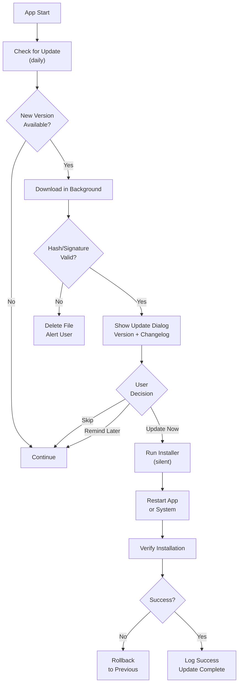

# 03 Desktop-Updates (Windows, macOS, Linux)

## Überblick

Desktop-Anwendungen haben unterschiedliche Update-Anforderungen je nach Betriebssystem. Dieses Kapitel behandelt die Besonderheiten jeder Plattform und Best Practices für robuste, sichere Updates.

## Windows-Updates

### Anforderungen

- **.exe Installer** oder **Portable EXE**
- Code-Signierung erforderlich (für Installation ohne UAC-Warnungen)
- Update-Installer sollte Silent-Mode unterstützen
- Registry-Einträge optional für Add/Remove Programs
- Restart meist erforderlich

### Update-Quellen

1. **GitHub Releases** — Kostenlos, einfach
2. **Custom Server** — Volle Kontrolle, braucht Hosting
3. **CDN (z.B. CloudFront)** — Schnell, skalierbar

### Installer-Typen

#### MSI (Windows Installer)

```powershell
# MSI-Paket erstellen (mit Tools wie WiX Toolset)
# Installation (Silent):
msiexec /i app-2.1.0.msi /quiet /norestart

# Deinstallation:
msiexec /x {GUID} /quiet /norestart
```

**Pros:**
- Windows-Standard
- System-Integration (Add/Remove Programs)
- Rollback-Unterstützung

**Cons:**
- Komplexer (braucht WiX oder ähnlich)
- Größere Dateigröße

#### EXE Installer

```batch
REM Nullsoft Scriptable Install System (NSIS) - kostenlos
REM Installation (Silent):
app-2.1.0.exe /S /D=C:\Program Files\MyApp

REM Deinstallation:
"C:\Program Files\MyApp\uninstall.exe" /S
```

**Pros:**
- Einfach zu erstellen
- Kleinere Dateigröße
- Flexible Customization

**Cons:**
- Weniger System-Integration
- UAC-Warnung bei Code-Signierung

#### Portable EXE

```batch
REM Einfach: einzelne .exe ohne Installation
app-2.1.0-portable.exe
REM Nutzer kann überall ablegen
```

**Pros:**
- Kein Installer nötig
- USB-portabel
- Sofort lauffähig

**Cons:**
- Keine System-Integration
- User-Kontrolle über Ort
- Schwer zu aktualisieren

### Code-Signierung (Windows)

Um UAC-Warnungen zu vermeiden:

```powershell
# 1. Get Code-Signing Certificate (kaufen bei Digicert, Sectigo, etc.)
# Kosten: $200–500/Jahr

# 2. Sign EXE
signtool sign /f "MyCert.pfx" /p "password" /t "http://timestamp.digicert.com" app.exe

# 3. Verify Signature
signtool verify /pa app.exe

# 4. Im Update-Manifest dokumentieren:
# {
#   "signature": "SignatureThumbprint",
#   "certificateSubject": "CN=MyCompany"
# }
```

### Windows Update-Manifest

```json
{
  "platform": "windows",
  "latestVersion": "2.1.0",
  "downloadUrl": "https://releases.example.com/app-2.1.0-installer.exe",
  "downloadUrlPortable": "https://releases.example.com/app-2.1.0-portable.exe",
  "hash": "sha256:abc123def456...",
  "signature": "Thumbprint:ABC123...",
  "installerType": "exe",
  "installerArgs": "/S /D=C:\\Program Files\\MyApp",
  "minimumOsVersion": "10.0.0",
  "architecture": ["x86", "x64"],
  "changelog": "Bug fixes, performance improvements",
  "releaseDate": "2026-06-20"
}
```

### Windows Update-Logik (Pseudo-Code)

```csharp
// C# / WPF Example Pattern
class WindowsUpdater {
  async Task CheckAndUpdate() {
    var manifest = await FetchManifest();
    
    if (Version.Parse(manifest.latestVersion) > 
        Version.Parse(app.Version)) {
      
      // Download
      var file = await DownloadFile(manifest.downloadUrl);
      
      // Verify Hash
      if (SHA256Hash(file) != manifest.hash) {
        throw new Exception("Hash mismatch");
      }
      
      // Verify Signature (optional but recommended)
      if (!VerifySignature(file, manifest.signature)) {
        throw new Exception("Invalid signature");
      }
      
      // Run Installer (silent)
      var process = Process.Start(new ProcessStartInfo {
        FileName = file,
        Arguments = manifest.installerArgs,
        UseShellExecute = false,
        RedirectStandardOutput = true
      });
      
      process.WaitForExit();
      
      // App restarts automatically (installer handles it)
    }
  }
}
```

## macOS-Updates

### Anforderungen

- **.dmg** (Disk Image) für Distribution
- **Code-Signing** erforderlich (für Gatekeeper)
- **Notarization** erforderlich (seit macOS 10.15)
- `.app` Bundle-Struktur
- Sparkle Framework (quasi-Standard) oder Electron Updater

### Code-Signierung & Notarization

```bash
# 1. Sign the APP bundle
codesign --deep --force --verify \
  --verbose \
  --sign "Developer ID Application: My Company" \
  MyApp.app

# 2. Create DMG
hdiutil create -volname "MyApp 2.1.0" \
  -srcfolder ./MyApp.app \
  -ov -format UDZO \
  MyApp-2.1.0.dmg

# 3. Sign DMG
codesign -s "Developer ID Application: My Company" \
  MyApp-2.1.0.dmg

# 4. Notarize (Apple online service)
xcrun notarytool submit MyApp-2.1.0.dmg \
  --apple-id "developer@example.com" \
  --password "app-specific-password" \
  --team-id "ABCD1234"

# 5. Wait for approval, then staple
xcrun stapler staple MyApp-2.1.0.dmg
```

### macOS Update-Manifest (Sparkle Format)

```xml
<?xml version="1.0" encoding="UTF-8"?>
<rss version="2.0" xmlns:sparkle="http://www.andymatuschak.org/xml-namespaces/sparkle">
  <channel>
    <title>MyApp Updates</title>
    <link>https://example.com</link>
    <description>Most recent changes</description>
    <item>
      <title>Version 2.1.0</title>
      <pubDate>Fri, 20 Jun 2026 00:00:00 +0000</pubDate>
      <sparkle:releaseNotesLink>
        https://example.com/release-notes-2.1.0.html
      </sparkle:releaseNotesLink>
      <enclosure 
        url="https://releases.example.com/MyApp-2.1.0.dmg"
        sparkle:version="2.1.0"
        sparkle:shortVersionString="2.1"
        sparkle:signature="MEcCIQDX..."
        length="123456789"
        type="application/octet-stream" />
    </item>
  </channel>
</rss>
```

### Sparkle Integration

```swift
// Swift/Cocoa with Sparkle Framework
import Sparkle

class AppDelegate: NSObject, NSApplicationDelegate {
  let updater = SPUStandardUpdaterController(
    startingUpdater: true,
    updaterDelegate: nil,
    userDriverDelegate: nil
  )
  
  func applicationDidFinishLaunching(_ aNotification: Notification) {
    // Feed URL for update manifest
    updater.updater.feedURL = URL(string: "https://example.com/appcast.xml")
    
    // Check for updates on startup
    updater.updater.checkForUpdatesInBackground()
  }
}
```

### macOS Update-Logik (Pseudo-Code)

```swift
class MacUpdater {
  func checkAndUpdate() {
    let manifest = URLSession.shared.dataTask(with: manifestURL) { data, _, _ in
      guard let xml = data else { return }
      
      // Parse Sparkle XML
      let version = parseVersion(xml)
      
      if version > currentVersion {
        // Show Update Dialog
        let alert = NSAlert()
        alert.messageText = "Update verfügbar: \(version)"
        alert.informativeText = "Jetzt updaten?"
        alert.addButton(withTitle: "Update")
        alert.addButton(withTitle: "Später")
        
        if alert.runModal() == .alertFirstButtonReturn {
          // Download DMG
          downloadFile(url: manifest.enclosureURL) { dmgFile in
            // Verify Signature
            if !verifySignature(dmgFile, manifest.signature) {
              showError("Invalid signature")
              return
            }
            
            // Mount DMG and copy APP
            let task = Process()
            task.executableURL = URL(fileURLWithPath: "/usr/bin/hdiutil")
            task.arguments = ["attach", dmgFile, "-noautoopen"]
            try? task.run()
            
            // Copy .app to Applications
            try? FileManager.default.copyItem(
              at: volumeAppPath,
              to: URL(fileURLWithPath: "/Applications/MyApp.app")
            )
          }
        }
      }
    }.resume()
  }
}
```

## Linux-Updates

### Anforderungen

- **AppImage** (portable), **Snap**, oder **Flatpak**
- Package Manager Integration (apt, yum, pacman)
- Update-Check für jede Verteilungsmethode unterschiedlich
- Meist Self-Hosted mit zsync für Diff-Updates

### Update-Methoden

#### 1. AppImage mit AppImageUpdate

```bash
# Build AppImage
./appimagetool app.AppDir MyApp-2.1.0.AppImage

# Create zsync metadata (für Diff-Updates)
zsyncmake MyApp-2.1.0.AppImage

# Manifest
# {
#   "latestVersion": "2.1.0",
#   "downloadUrl": "https://releases.example.com/MyApp-2.1.0.AppImage",
#   "zsyncUrl": "https://releases.example.com/MyApp-2.1.0.AppImage.zsync",
#   "hash": "sha256:..."
# }
```

**Pros:**
- Portable, kein Root erforderlich
- Diff-Updates möglich
- Einfache Distribution

**Cons:**
- zsync braucht Server-Unterstützung
- Nicht in App-Stores

#### 2. Snap (Ubuntu/Fedora)

```yaml
# snapcraft.yaml
name: myapp
version: 2.1.0
summary: My Application
description: A great app

apps:
  myapp:
    command: bin/myapp

parts:
  myapp:
    plugin: cmake
    source: .
```

```bash
# Build und Upload
snapcraft
snapcraft upload myapp_2.1.0_amd64.snap --release=stable
```

**Pros:**
- Automatische Updates (system-managed)
- Sandbox Security
- AppStore-Integration

**Cons:**
- Snap-Overhead (größer, langsamer)
- Linux-only (Ubuntu/Fedora vorwiegend)

#### 3. Package Manager (apt/yum)

```bash
# Create .deb package
dpkg-deb --build app-build/ myapp-2.1.0.deb

# Upload to PPA (Ubuntu Personal Package Archive)
# oder Self-Hosted Repo

# User installiert:
sudo apt update
sudo apt install myapp
# System-managed updates
```

**Pros:**
- System-integriert
- Automatische Updates
- Trusted Repo

**Cons:**
- Braucht Signierung (GPG)
- PPA-Setup komplex
- Approval-Prozess für official Repos

### Linux Update-Manifest

```json
{
  "platform": "linux",
  "latestVersion": "2.1.0",
  "appimage": {
    "downloadUrl": "https://releases.example.com/MyApp-2.1.0.AppImage",
    "zsyncUrl": "https://releases.example.com/MyApp-2.1.0.AppImage.zsync",
    "hash": "sha256:..."
  },
  "snap": {
    "channel": "stable",
    "version": "2.1.0"
  },
  "deb": {
    "repo": "https://ppa.example.com/ubuntu/",
    "package": "myapp",
    "architecture": ["amd64", "arm64"]
  },
  "releaseDate": "2026-06-20"
}
```

## Desktop Update-Flow (Unified Pattern)



## Plattformübergreifendes Manifest

```json
{
  "appName": "MyApp",
  "latestVersion": "2.1.0",
  "platforms": {
    "windows": {
      "x64": {
        "downloadUrl": "https://releases.example.com/MyApp-2.1.0-x64.exe",
        "hash": "sha256:...",
        "signature": "...",
        "installerArgs": "/S /D=C:\\Program Files\\MyApp"
      },
      "x86": {
        "downloadUrl": "https://releases.example.com/MyApp-2.1.0-x86.exe",
        "hash": "sha256:...",
        "signature": "..."
      }
    },
    "macos": {
      "downloadUrl": "https://releases.example.com/MyApp-2.1.0.dmg",
      "hash": "sha256:...",
      "notarizationStatus": "approved",
      "minimumVersion": "10.13"
    },
    "linux": {
      "appimage": {
        "downloadUrl": "https://releases.example.com/MyApp-2.1.0.AppImage",
        "hash": "sha256:..."
      },
      "snap": {
        "channel": "stable"
      }
    }
  },
  "minimumVersion": "1.5.0",
  "forceUpdate": false,
  "changelog": "- Fixed issue #123\n- Performance +20%",
  "releaseDate": "2026-06-20"
}
```

## Best Practices

### Sicherheit

1. **Code-Signiere immer** (Windows .exe, macOS .app, Linux .deb)
2. **Nutze HTTPS** für alle Download-URLs
3. **Verify Hash & Signature** vor Installation
4. **Backup alte Version** vor Update
5. **Never hardcode** Credentials in Updater-Code

### Benutzererfahrung

1. **Zeige Dialog mit Changelog** vor Update
2. **Download im Hintergrund** wenn möglich
3. **Progress-Bar** für lange Downloads (> 5MB)
4. **"Update später" Option** geben (außer Force-Updates)
5. **Restart-Benachrichtigung** vor Restart

### Zuverlässigkeit

1. **Netzwerk-Fehler abfangen** (Timeout, Connection Lost)
2. **Corrupted File Detection** (Hash-Mismatch)
3. **Automatic Retry** (exponential backoff)
4. **Rollback bei Fehler** auf alte Version
5. **Logging & Telemetry** für Debugging

---

**Weiter:** Kapitel 4 (Mobile-Updates) oder Kapitel 7 (Sicherheit)
