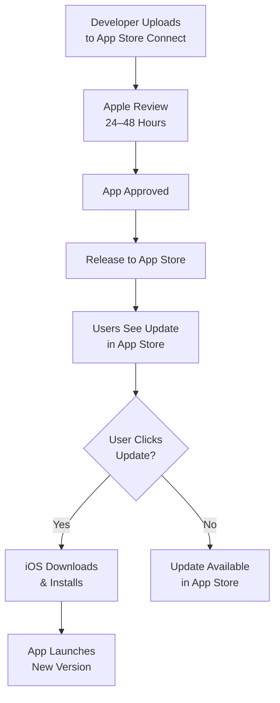
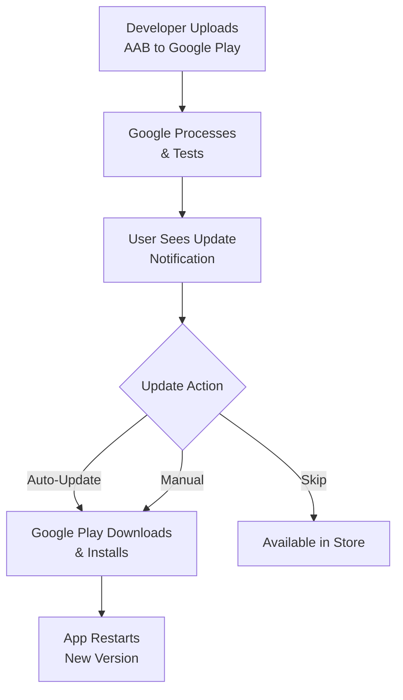

# 04 Mobile-Updates (iOS und Android)

## Überblick

Mobile-Updates unterscheiden sich grundlegend von Desktop-Updates: App Stores übernehmen die meisten Update-Mechanismen, aber Over-The-Air (OTA) Updates sind für schnellere Iterationen möglich.

Dieses Kapitel behandelt beide Ansätze.

## iOS App Store Updates

### Anforderungen

- **Apple Developer Account** ($99/Jahr)
- **Xcode & TestFlight** für Beta-Testing
- **App Store Connect** für Uploads
- **Build Number** & **Version String**
- Code-Signierung (automatisch durch Apple)

### Versionierung

```
Version String:    2.1.0       (MAJOR.MINOR.PATCH)
Build Number:      42          (nur Zahlen, monoton steigend)
```

iOS zwingt dich zu monoton steigenden Build Numbers:
- Build 1: Version 1.0.0
- Build 2: Version 1.0.1
- Build 3: Version 1.1.0
- Build 42: Version 2.1.0

```swift
// In Xcode Info.plist oder Build Settings
CFBundleShortVersionString = 2.1.0   // Version String
CFBundleVersion = 42                 // Build Number
```

### App Store Update-Flow (Apple-managed)



**Apple Automatic Updates:**
- Bei iOS 13+, Users können "Automatic App Updates" aktivieren
- iOS lädt & installiert Updates über Wi-Fi automatisch
- App restarts im Hintergrund

### Uploading to App Store

```bash
# 1. Archive im Xcode
xcodebuild archive -scheme MyApp \
  -archivePath build/MyApp.xcarchive

# 2. Export IPA
xcodebuild -exportArchive \
  -archivePath build/MyApp.xcarchive \
  -exportOptionsPlist ExportOptions.plist \
  -exportPath build/

# 3. Upload über Transporter oder App Store Connect (GUI)
xcrun altool --upload-app --file MyApp.ipa \
  --type ios \
  --apiKey "KEY_ID" \
  --apiIssuer "ISSUER_ID"

# oder: App Store Connect Web UI → My Apps → Upload
```

### iOS Update-Manifest (Optional für OTA)

Wenn du **CodePush** nutzt für schnellere OTA-Updates:

```json
{
  "platform": "ios",
  "latestVersion": "2.1.0",
  "buildNumber": 42,
  "appStoreUrl": "https://apps.apple.com/app/myapp/id123456789",
  "requiresAppStoreUpdate": false,
  "codePushVersion": "v2.1.0-codepush.5",
  "codePushUrl": "https://codepush.example.com/releases/v2.1.0-codepush.5.zip",
  "changelog": "Bug fixes and performance improvements",
  "releaseDate": "2026-06-20"
}
```

## iOS CodePush (React Native / Flutter)

**CodePush** ermöglicht OTA-JavaScript/Dart-Updates **ohne** App Store-Review.

### Mit Microsoft AppCenter CodePush

```bash
# 1. Install CLI
npm install -g appcenter-cli

# 2. Login
appcenter login

# 3. Create Release
appcenter codepush release-react \
  --app "Organization/MyApp-iOS" \
  --deploymentName Production \
  --description "Bug fix for issue #123"

# 4. Verify Release
appcenter codepush deployment list \
  --app "Organization/MyApp-iOS"
```

### CodePush Integration (React Native)

```javascript
// App.js
import CodePush from "react-native-code-push";

let App = () => {
  React.useEffect(() => {
    CodePush.checkForUpdate()
      .then((update) => {
        if (update) {
          CodePush.sync(
            {
              updateDialog: true,
              installMode: CodePush.InstallMode.IMMEDIATE,
            },
            (status) => {
              console.log("CodePush status:", status);
            }
          );
        }
      });
  }, []);

  return <YourApp />;
};

// Wrap with CodePush
App = CodePush(App);

export default App;
```

### CodePush Dialog UX

```javascript
const updateDialog = {
  appIsReadyTitle: "Update Ready!",
  appIsReadyMessage:
    "A new version of MyApp is available. Install now?",
  mandatoryUpdateMessage:
    "You must update to continue using MyApp.",
  mandatoryContinueButtonLabel: "Update Now",
  optionalIgnoreButtonLabel: "Later",
  optionalInstallButtonLabel: "Install",
  optionalIgnoreButtonLabel: "Skip",
};
```

## Android App Store (Google Play) Updates

### Anforderungen

- **Google Play Developer Account** ($25, one-time)
- **Android App Bundle** (.aab) oder **APK**
- **Version Code** (monoton steigend) & **Version Name** (MAJOR.MINOR.PATCH)
- Signed APK/AAB with Release Key
- Google Play Console für Uploads

### Versionierung

```
versionName:    2.1.0           (User-visible)
versionCode:    42              (internal, monoton steigend)
```

```xml
<!-- AndroidManifest.xml -->
<manifest
  android:versionCode="42"
  android:versionName="2.1.0">
</manifest>
```

### Building APK/AAB

```bash
# 1. Build Signed APK
./gradlew assembleRelease \
  -Pandroid.injected.signing.store.file=release.keystore \
  -Pandroid.injected.signing.store.password=password \
  -Pandroid.injected.signing.key.alias=release_key \
  -Pandroid.injected.signing.key.password=password

# 2. oder Build AAB (recommended)
./gradlew bundleRelease

# 3. Optionally: Sign APK
jarsigner -verbose -sigalg SHA1withRSA -digestalg SHA1 \
  -keystore release.keystore \
  app-release-unsigned.apk release_key

zipalign -v 4 app-release-unsigned.apk app-release.apk

# 4. Upload zu Google Play Console
# (GUI: Release → Create Release → Upload AAB)
```

### Google Play Update-Flow



**Google Play Automatic Updates:**
- User kann "Auto-update" in Play Store Settings aktivieren
- Play Store lädt & installiert über Wi-Fi (default)
- Restart optioniert oder automatisch

## Android In-App Updates (Google Play API)

Für schnellere Updates ohne App Store-Verzögerung:

```gradle
// build.gradle
dependencies {
  implementation 'com.google.android.play:core:1.10.3'
}
```

```kotlin
// MainActivity.kt
import com.google.android.play.core.appupdate.AppUpdateManager
import com.google.android.play.core.appupdate.AppUpdateManagerFactory
import com.google.android.play.core.install.model.AppUpdateType

class MainActivity : AppCompatActivity() {
  private lateinit var appUpdateManager: AppUpdateManager

  override fun onCreate(savedInstanceState: Bundle?) {
    super.onCreate(savedInstanceState)
    
    appUpdateManager = AppUpdateManagerFactory.create(this)
    
    appUpdateManager.appUpdateInfo.addOnSuccessListener { appUpdateInfo ->
      if (appUpdateInfo.updateAvailability() == UPDATE_AVAILABLE &&
          appUpdateInfo.isUpdateTypeAllowed(IMMEDIATE)) {
        
        // For IMMEDIATE: show dialog & install
        appUpdateManager.startUpdateFlow(
          appUpdateInfo,
          IMMEDIATE,
          activityResultContract
        )
      } else if (appUpdateInfo.updateAvailability() == UPDATE_AVAILABLE &&
                 appUpdateInfo.isUpdateTypeAllowed(FLEXIBLE)) {
        
        // For FLEXIBLE: background download, notify when ready
        appUpdateManager.startUpdateFlow(
          appUpdateInfo,
          FLEXIBLE,
          activityResultContract
        )
      }
    }
  }

  private val activityResultContract =
    registerForActivityResult(StartIntentSenderForResult()) { result ->
      if (result.resultCode == RESULT_OK) {
        Log.d("AppUpdate", "Update initiated")
      } else if (result.resultCode == RESULT_CANCELED) {
        Log.d("AppUpdate", "Update canceled by user")
      }
    }
}
```

### In-App Update Types

| Type | Behavior | Use Case |
|------|----------|----------|
| **IMMEDIATE** | Dialog, forces update, app closes | Security patches |
| **FLEXIBLE** | Background download, notify when ready | Feature updates |

## Android Custom OTA (Self-hosted)

Für **vollständige Kontrolle** (nicht über Google Play):

```java
// OTAManager.java
public class OTAManager {
  private Context context;
  private String manifestUrl = "https://updates.example.com/manifest.json";
  
  public void checkForUpdate() {
    new Thread(() -> {
      try {
        // 1. Fetch Manifest
        HttpURLConnection conn = (HttpURLConnection) 
          new URL(manifestUrl).openConnection();
        String response = readStream(conn.getInputStream());
        JSONObject manifest = new JSONObject(response);
        
        // 2. Check Version
        String latestVersion = manifest.getString("latestVersion");
        String currentVersion = BuildConfig.VERSION_NAME;
        
        if (isNewerVersion(latestVersion, currentVersion)) {
          // 3. Download APK
          downloadAPK(manifest.getString("downloadUrl"));
          
          // 4. Verify Hash
          String expectedHash = manifest.getString("hash");
          if (!verifyHash(apkFile, expectedHash)) {
            return; // Abort
          }
          
          // 5. Install
          installAPK(apkFile);
        }
      } catch (Exception e) {
        e.printStackTrace();
      }
    }).start();
  }
  
  private void installAPK(File apk) {
    Intent intent = new Intent(Intent.ACTION_VIEW);
    intent.setDataAndType(
      Uri.fromFile(apk),
      "application/vnd.android.package-archive"
    );
    context.startActivity(intent);
  }
}
```

**Achtung:** Requires `REQUEST_INSTALL_PACKAGES` permission!

## Cross-Platform (React Native / Flutter) OTA

### React Native with expo-updates

```bash
# Build & Upload
eas update

# In app:
import * as Updates from 'expo-updates';

export default function App() {
  React.useEffect(() => {
    Updates.checkForUpdateAsync().then((update) => {
      if (update.isAvailable) {
        Updates.fetchUpdateAsync();
        // Notify user to restart
      }
    });
  }, []);

  return <YourApp />;
}
```

### Flutter with shorebird

```bash
# Install
dart pub global activate shorebird_cli

# Build
shorebird build apk
shorebird build ios

# Release OTA Patch
shorebird patch android --target lib/main.dart
```

## Mobile Update-Manifest (Unified)

```json
{
  "appName": "MyApp",
  "latestVersion": "2.1.0",
  "platforms": {
    "ios": {
      "appStoreUrl": "https://apps.apple.com/app/myapp/id123456789",
      "buildNumber": 42,
      "requiresAppStoreUpdate": false,
      "codePush": {
        "available": true,
        "version": "v2.1.0-cp5",
        "downloadUrl": "https://codepush.example.com/v2.1.0-cp5.zip",
        "hash": "sha256:..."
      }
    },
    "android": {
      "googlePlayUrl": "https://play.google.com/store/apps/details?id=com.example.myapp",
      "versionCode": 42,
      "playStoreUpdate": {
        "available": true,
        "updateType": "FLEXIBLE"
      },
      "customOTA": {
        "available": false,
        "downloadUrl": null
      }
    }
  },
  "minimumVersion": "1.5.0",
  "forceUpdate": false,
  "changelog": "Bug fixes and UI improvements",
  "releaseDate": "2026-06-20"
}
```

## Best Practices für Mobile

### App Store Considerations

1. **App Store Review** dauert 24–48h → Plan Reviews ein
2. **Beta-Testing via TestFlight (iOS) & Google Play Beta** vor Release
3. **Build Number muss monoton steigen** (kein Downgrade!)
4. **Version String muss MAJOR.MINOR.PATCH sein** (für User lesbar)
5. **Screenshots & Release Notes** müssen aktuell sein

### User Experience

1. **Zeige Changelog** vor Update
2. **"Update später" Option** geben (außer Forced Updates)
3. **Zeige Progress** bei Download/Installation
4. **Notify bei Fehler** (Netzwerk, Storage voll, etc.)
5. **Auto-Update nur über Wi-Fi** (Data-Sparen)

### Sicherheit

1. **Sign alle Releases** (Xcode/Gradle automatic)
2. **Verify Hash** bei Custom OTA
3. **HTTPS nur** für Download-URLs
4. **Never expose Signing Keys** in Code
5. **Test Update-Pfad** mit alte zu neue Version

### Zuverlässigkeit

1. **Handle netzwerk-Fehler** (Retry mit Backoff)
2. **Graceful Downgrade** wenn Update fehlschlägt
3. **Storage-Check** vor Download (disk space)
4. **Test auf verschiedenen Devices** (unterschiedliche RAM/OS-Versionen)
5. **Telemetry-Logging** für Debugging

---

**Weiter:** Kapitel 5 (Web-Updates) oder Kapitel 7 (Sicherheit)
