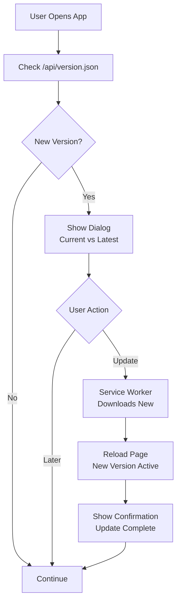

# 05 Web-App-Updates (SPA, PWA, Service Worker)

## Überblick

Web-Apps haben es einfacher: Der Server kontrolliert immer die **aktuelle Version**. Die Herausforderung liegt darin, Nutzern zu zeigen, dass Updates verfügbar sind, und alte Browser-Cache zu invalidieren.

## Update-Strategien für SPAs

### Strategy 1: Full Page Reload

**Einfachste Methode:** Nutzer refresht Browser oder navigiert erneut → neue Version laden.

```html
<!-- index.html -->
<!DOCTYPE html>
<html>
<head>
  <meta name="app-version" content="2.1.0" />
  <script>
    // Check version alle 5 Minuten
    setInterval(async () => {
      const response = await fetch('/version.json');
      const data = await response.json();
      
      const currentVersion = document.querySelector('meta[name="app-version"]')
        .getAttribute('content');
      
      if (data.version > currentVersion) {
        // New version available
        console.log('Update verfügbar:', data.version);
        
        // Show dialog
        if (confirm('Neue Version verfügbar. Jetzt laden?')) {
          // Hard refresh (bypass cache)
          location.reload(true); // or location.href = location.href
        }
      }
    }, 5 * 60 * 1000);
  </script>
</head>
<body>...</body>
</html>
```

**Pros:**
- Sehr einfach
- Garantiert neue Version
- Keine Komplexität

**Cons:**
- Nutzer muss manuell aktualisieren
- Unkontrollierte Reload-Momente
- Schlechte UX

### Strategy 2: Service Worker mit Skip-Waiting

**Modern:** Service Worker lädt neue Version im Hintergrund, nutzt diese beim Reload.

```javascript
// service-worker.js
const CACHE_VERSION = 'v2.1.0';

self.addEventListener('install', (event) => {
  console.log('Service Worker installing:', CACHE_VERSION);
  event.waitUntil(
    caches.open(CACHE_VERSION).then((cache) => {
      return cache.addAll([
        '/',
        '/index.html',
        '/styles.css',
        '/app.js',
        '/manifest.json',
      ]);
    })
  );
});

self.addEventListener('activate', (event) => {
  console.log('Service Worker activating');
  event.waitUntil(
    caches.keys().then((cacheNames) => {
      return Promise.all(
        cacheNames
          .filter((name) => name !== CACHE_VERSION)
          .map((name) => {
            console.log('Deleting old cache:', name);
            return caches.delete(name);
          })
      );
    })
  );
});

self.addEventListener('fetch', (event) => {
  event.respondWith(
    caches.match(event.request).then((response) => {
      // Return cached version if available
      if (response) return response;
      
      // Otherwise fetch from network
      return fetch(event.request).then((response) => {
        // Don't cache non-successful responses
        if (!response || response.status !== 200 || response.type !== 'basic') {
          return response;
        }
        
        // Cache successful responses
        const responseToCache = response.clone();
        caches.open(CACHE_VERSION).then((cache) => {
          cache.put(event.request, responseToCache);
        });
        
        return response;
      });
    })
  );
});
```

```javascript
// main.js (in app)
let updatingServiceWorker = null;

if ('serviceWorker' in navigator) {
  navigator.serviceWorker
    .register('/service-worker.js')
    .then((registration) => {
      console.log('Service Worker registered');
      
      // Listen for updates
      registration.onupdatefound = () => {
        const newWorker = registration.installing;
        
        newWorker.onstatechange = () => {
          if (newWorker.state === 'installed' && 
              navigator.serviceWorker.controller) {
            
            // New service worker is ready
            updatingServiceWorker = newWorker;
            
            // Show notification to user
            showUpdateNotification({
              message: 'Neue Version verfügbar',
              actions: [
                {
                  label: 'Jetzt aktualisieren',
                  onClick: () => {
                    updatingServiceWorker.postMessage({ type: 'SKIP_WAITING' });
                    window.location.reload();
                  }
                },
                {
                  label: 'Später',
                  onClick: () => {}
                }
              ]
            });
          }
        };
      };
    })
    .catch((error) => {
      console.error('Service Worker registration failed:', error);
    });
}
```

**Pros:**
- Offline-Funktionalität
- Schnelle Laden (Cache-First)
- User kontrolliert Timing

**Cons:**
- Komplexer Code
- Browser-Cache-Verhalten kann tricky sein
- Debugging schwierig

### Strategy 3: Hash-Based Versioning (Build Output)

**Best Practice:** Jede Build erzeugt eindeutige Hash-basierte Filenames.

```html
<!-- index.html (generated by build tool) -->
<!DOCTYPE html>
<html>
<head>
  <meta name="app-version" content="2.1.0" />
  <!-- Build tool generiert diese Hashes automatisch -->
  <link rel="stylesheet" href="/styles.a3f4b2c1d5e6.css" />
  <script src="/app.d8e9f0a1b2c3.js"></script>
</head>
<body>
  <div id="app"></div>
  
  <script>
    // Check if new version exists every 5 minutes
    setInterval(async () => {
      const response = await fetch('/index.html');
      const html = await response.text();
      const parser = new DOMParser();
      const doc = parser.parseFromString(html, 'text/html');
      
      const newVersion = doc.querySelector('meta[name="app-version"]')
        .getAttribute('content');
      const currentVersion = document.querySelector('meta[name="app-version"]')
        .getAttribute('content');
      
      if (newVersion > currentVersion) {
        showUpdateDialog('Neue Version: ' + newVersion);
      }
    }, 5 * 60 * 1000);
  </script>
</body>
</html>
```

**Build-Tool Configuration (webpack/vite):**

```javascript
// webpack.config.js
const path = require('path');

module.exports = {
  mode: 'production',
  entry: './src/index.js',
  output: {
    path: path.resolve(__dirname, 'dist'),
    filename: '[name].[contenthash:8].js', // Hash based
    assetModuleFilename: 'assets/[name].[hash:8][ext]'
  },
  // ... rest of config
};
```

**Vite:**

```javascript
// vite.config.js
export default {
  build: {
    rollupOptions: {
      output: {
        entryFileNames: 'js/[name].[hash].js',
        chunkFileNames: 'js/[name].[hash].js',
        assetFileNames: 'assets/[name].[hash][extname]'
      }
    }
  }
};
```

**Pros:**
- Cache-busting automatisch
- Keine Komplexität im Code
- Best Performance

**Cons:**
- Braucht Build-Tool Support
- Manifest muss per HTTP fetched werden

## CDN Cache Busting

Mit CDN (CloudFront, Cloudflare, etc.) musst du Cache-Invalidation managen:

```javascript
// Option 1: Version Query Parameter
const appVersion = '2.1.0';
const script = document.createElement('script');
script.src = `/app.js?v=${appVersion}`;
document.head.appendChild(script);
```

```html
<!-- Option 2: Cache-Control Headers (best) -->
<!-- In HTTP Response Headers -->
Cache-Control: max-age=3600, must-revalidate
ETag: "abc123def456"
```

```bash
# Option 3: Invalidate CDN Cache
# AWS CloudFront
aws cloudfront create-invalidation \
  --distribution-id E1234EXAMPLE \
  --paths "/index.html" "/app.js" "/styles.css"

# Cloudflare
curl -X POST "https://api.cloudflare.com/client/v4/zones/{zone_id}/purge_cache" \
  -H "X-Auth-Email: {email}" \
  -H "X-Auth-Key: {api_key}" \
  -H "Content-Type: application/json" \
  --data '{"files":["https://example.com/index.html"]}'
```

## Version-Manifest als JSON API

Für zentrale Versioning-Kontrolle:

```javascript
// /api/version.json (server)
{
  "appName": "MyApp",
  "latestVersion": "2.1.0",
  "minimumVersion": "1.5.0",
  "features": {
    "webApp": {
      "version": "2.1.0",
      "updateAvailable": true,
      "changelog": [
        "Fixed bug #123",
        "Added feature X",
        "Performance +20%"
      ],
      "criticalUpdate": false
    },
    "api": {
      "version": "3.0.0",
      "deprecatedVersions": ["1.0.0", "1.5.0"],
      "minSupportedVersion": "2.0.0"
    }
  },
  "releaseDate": "2026-06-20",
  "supportUrl": "https://example.com/changelog/2.1.0"
}
```

```javascript
// App-Code
async function checkForUpdate() {
  const response = await fetch('/api/version.json');
  const manifest = await response.json();
  
  const currentVersion = window.APP_VERSION; // '2.0.5'
  const latestVersion = manifest.latestVersion; // '2.1.0'
  
  if (semver.gt(latestVersion, currentVersion)) {
    // Show update dialog
    showUpdateDialog({
      currentVersion,
      latestVersion,
      changelog: manifest.features.webApp.changelog,
      isCritical: manifest.features.webApp.criticalUpdate
    });
  }
}
```

## Progressive Web App (PWA) Updates

```json
{
  "manifest.json": {
    "name": "MyApp",
    "short_name": "MyApp",
    "start_url": "/",
    "display": "standalone",
    "theme_color": "#000000",
    "background_color": "#ffffff",
    "icons": [
      {
        "src": "/icon-192.png",
        "sizes": "192x192",
        "type": "image/png"
      },
      {
        "src": "/icon-512.png",
        "sizes": "512x512",
        "type": "image/png"
      }
    ]
  }
}
```

PWAs nutzen Service Worker für Auto-Updates:

```javascript
// PWA Update Handler
if ('serviceWorkerContainer' in navigator) {
  navigator.serviceWorkerContainer.addEventListener('controllerchange', () => {
    // New SW took control → page reload
    window.location.reload();
  });
  
  // Check for updates periodically
  setInterval(() => {
    navigator.serviceWorkerContainer.getRegistrations().then((registrations) => {
      registrations.forEach((reg) => {
        reg.update(); // Check for new SW
      });
    });
  }, 60000); // Every minute
}
```

## Web App Update-Flow



## Best Practices

### Caching-Strategie

1. **Static Assets (CSS, JS, Images):** Hash-Based, immutable cache (1 year)
2. **HTML:** No Cache / must-revalidate (always check server)
3. **API:** ETag-based, 5-10 minute cache

### Version-Checking

1. **Automatic Check:** Alle 5–30 Minuten im Hintergrund
2. **On-Demand:** Button "Check for Updates" in Settings
3. **Show Dialog:** Mit Changelog, Update-Timing-Info
4. **Erzwungenes Update:** Nach kritischen Security-Patches

### Browser-Kompatibilität

- **Service Worker:** Alle modernen Browser (IE11 nicht supported)
- **Fallback:** Für alte Browser → Full Page Reload Strategy
- **Progressive Enhancement:** Feature-Detect vor Service Worker-Nutzung

### Performance

1. **Lazy Load Scripts:** Nutze dynamic imports für große Chunks
2. **Code Splitting:** Separate Bundles für verschiedene Routes
3. **Prefetch New Version:** Download im Hintergrund, nicht blocking
4. **Measure Load Time:** Telemetry für Cache-Hit-Rate

---

**Weiter:** Kapitel 6 (Backend-Updates) oder Kapitel 9 (Version-Manifest)
