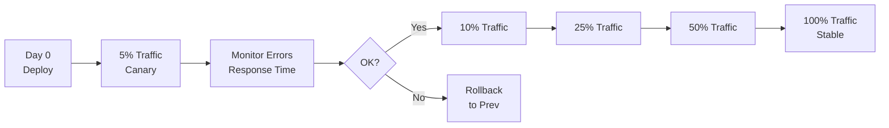

# 06 Backend-Updates (API Versioning & Deployments)

## Überblick

Backend-Updates sind anders als Frontend: Die App hat **keine Kontrolle** über die Server-Version. Statt Updates "downzuloaden" musst du die API **rückwärts-kompatibel** halten oder alte Clients mit Feature-Flags managen.

## API Versioning Strategien

### Strategy 1: URL-Versioning

```
/api/v1/users      → Version 1
/api/v2/users      → Version 2
/api/v3/users      → Version 3 (latest)
```

**Pros:**
- Sehr explizit
- Alte Clients funktionieren weiter
- Einfach zu debuggen

**Cons:**
- Viele API-Versionen zu maintainen
- Code-Duplikation
- Server-Last

```javascript
// Express.js Example
const express = require('express');
const app = express();

// V1 Router
const v1Router = require('./routes/v1');
app.use('/api/v1', v1Router);

// V2 Router (breaking changes)
const v2Router = require('./routes/v2');
app.use('/api/v2', v2Router);

// Both can coexist
```

### Strategy 2: Header-Versioning

```http
GET /api/users
Accept-Version: 1.0.0
```

oder

```http
GET /api/users
X-API-Version: 2.0.0
```

**Pros:**
- Saubere URLs
- REST-konform

**Cons:**
- Weniger explizit
- Browser können nicht unterschiedliche Header senden

```javascript
// Express.js Middleware
function apiVersionMiddleware(req, res, next) {
  const version = req.headers['accept-version'] || '1.0.0';
  req.apiVersion = semver.major(version);
  next();
}

app.get('/api/users', apiVersionMiddleware, (req, res) => {
  if (req.apiVersion >= 2) {
    // V2 Response
    res.json({ users: [...], meta: { total: 100, page: 1 } });
  } else {
    // V1 Response (simpler)
    res.json({ users: [...] });
  }
});
```

### Strategy 3: Content Negotiation

```http
GET /api/users
Content-Type: application/vnd.myapi.v2+json
```

Weniger gebräuchlich, aber semantisch richtig.

## Backwards-Kompatibilität (Goldene Regel)

**Niemals Breaking Changes machen ohne:**

1. **Deprecation Period** (3–6 Monate Vorwarnung)
2. **New Version verfügbar** (alte & neue parallel)
3. **Clear Migration Guide** für Clients

### Sichere API-Änderungen

```javascript
// SAFE: Neue optionale Felder hinzufügen
// V1 Response
{ id: 1, name: "John" }

// V2 Response (backwards compatible)
{ id: 1, name: "John", email: "john@example.com" }
// Alte Clients ignorieren email, funktioniert weiter
```

```javascript
// UNSAFE: Feld umbenennen
// V1 Response
{ id: 1, user_id: 123 }

// V2 Response (BREAKING!)
{ id: 1, userId: 123 }  // ← Alte Clients brechen
```

```javascript
// SAFE: Feld deprecaten & ersetzen
// V1 Response
{ id: 1, user_id: 123 }

// V2 Response (mit Warnung)
{
  id: 1,
  user_id: 123,  // ← Keep for backwards compat
  userId: 123,   // ← New field
  _warnings: [
    {
      field: "user_id",
      message: "Deprecated: use 'userId' instead",
      removedInVersion: "3.0.0"
    }
  ]
}
```

## Feature Flags für Graduelle Rollouts

**Canary Deployments:** Neue API hinter Feature-Flag, nur für 5% der Nutzer.

```javascript
// Server-seitig
const featureFlags = {
  'api.v3': { enabled: true, percentage: 5 }  // 5% Nutzer
};

function isFeatureEnabled(userId, featureName) {
  const flag = featureFlags[featureName];
  if (!flag.enabled) return false;
  
  // Hash userId für konsistent verteilung
  const hash = hashFunction(userId);
  const inGroup = (hash % 100) < flag.percentage;
  
  return inGroup;
}

app.get('/api/users/:id', (req, res) => {
  if (isFeatureEnabled(req.userId, 'api.v3')) {
    // V3 Implementation
    return res.json({ user: {...}, version: 3 });
  } else {
    // V2 Implementation
    return res.json({ user: {...}, version: 2 });
  }
});
```

### Feature Flag Management (LaunchDarkly, Unleash)

```javascript
// Unleash SDK Example
const { initialize } = require('unleash-client');

const unleash = initialize({
  url: 'https://unleash.example.com/client',
  clientKey: 'secret-key',
  appName: 'my-backend'
});

unleash.on('ready', () => {
  if (unleash.isEnabled('api-v3')) {
    // Use V3 API
  }
});
```

## Graduelle Deployment-Strategie



```yaml
# Kubernetes Deployment Rollout Strategy
apiVersion: apps/v1
kind: Deployment
metadata:
  name: api-server
spec:
  replicas: 10
  strategy:
    type: RollingUpdate
    rollingUpdate:
      maxSurge: 2          # 2 neue Pods parallel
      maxUnavailable: 0    # 0 Pods down (Zero-downtime)
  template:
    spec:
      containers:
      - name: api
        image: myapi:v2.1.0
        resources:
          requests:
            memory: "256Mi"
            cpu: "500m"
        livenessProbe:
          httpGet:
            path: /health
            port: 8080
          initialDelaySeconds: 30
          periodSeconds: 10
        readinessProbe:
          httpGet:
            path: /ready
            port: 8080
          initialDelaySeconds: 5
          periodSeconds: 5
```

## Database Migrations

**Regel:** Immer non-blocking Migrations (die Datenbank bleibt verfügbar).

### Safe Migration Pattern

```sql
-- Step 1: Add new column (non-blocking)
ALTER TABLE users ADD COLUMN email_normalized VARCHAR(255);

-- Step 2: Backfill data (in batches, non-blocking)
UPDATE users SET email_normalized = LOWER(email) 
  WHERE id % 10 = 0  -- batch

-- Step 3: App writes to both columns (dual-write)
-- INSERT INTO users (email, email_normalized) VALUES (?, LOWER(?))

-- Step 4: Once 100% backfilled, make column NOT NULL
ALTER TABLE users ALTER COLUMN email_normalized SET NOT NULL;

-- Step 5: Cleanup old column (optional)
ALTER TABLE users DROP COLUMN email;
```

**Oder nutze Migrations-Tools:**

```bash
# Flyway
flyway -locations=filesystem:db/migration migrate

# Liquibase
liquibase update

# Django
python manage.py migrate
```

## Monitoring & Rollback-Trigger

### Health Checks

```javascript
// /health endpoint
app.get('/health', (req, res) => {
  const checks = {
    database: isDatabaseHealthy(),
    cache: isCacheHealthy(),
    disk: isDiskAvailable(),
    memory: isMemoryAvailable()
  };
  
  const allHealthy = Object.values(checks).every(c => c);
  
  res.status(allHealthy ? 200 : 503).json({
    status: allHealthy ? 'healthy' : 'unhealthy',
    checks,
    timestamp: new Date().toISOString()
  });
});
```

### Error Rate Monitoring

```javascript
// Prometheus Metrics
const prometheus = require('prom-client');

const httpRequestDuration = new prometheus.Histogram({
  name: 'http_request_duration_seconds',
  help: 'Duration of HTTP requests in seconds',
  labelNames: ['method', 'route', 'status_code']
});

const errorRate = new prometheus.Counter({
  name: 'http_errors_total',
  help: 'Total number of HTTP errors',
  labelNames: ['method', 'route', 'status_code']
});

app.use((req, res, next) => {
  const start = Date.now();
  
  res.on('finish', () => {
    const duration = (Date.now() - start) / 1000;
    httpRequestDuration
      .labels(req.method, req.route.path, res.statusCode)
      .observe(duration);
    
    if (res.statusCode >= 400) {
      errorRate
        .labels(req.method, req.route.path, res.statusCode)
        .inc();
    }
  });
  
  next();
});
```

### Automated Rollback

```bash
#!/bin/bash
# Auto-rollback script
ERROR_THRESHOLD=5  # 5% error rate

while true; do
  ERROR_RATE=$(curl -s http://prometheus:9090/query?query=rate%28http_errors_total%5B1m%5D%29 \
    | jq '.data.result[0].value[1]' | tr -d '"')
  
  if (( $(echo "$ERROR_RATE > $ERROR_THRESHOLD" | bc -l) )); then
    echo "Error rate $ERROR_RATE% > $ERROR_THRESHOLD%. Rolling back..."
    
    # Rollback to previous version
    kubectl set image deployment/api-server \
      api=myapi:v2.0.0
    
    # Notify team
    curl -X POST https://slack.example.com/webhook \
      -d '{"text":"Backend rollback triggered: error rate too high"}'
  fi
  
  sleep 60
done
```

## Backend Update-Manifest

```json
{
  "service": "api-server",
  "latestVersion": "2.1.0",
  "previousVersion": "2.0.0",
  "deploymentStatus": {
    "stage": "canary",
    "percentage": 5,
    "since": "2026-06-20T10:00:00Z",
    "nextRolloutIn": "2 hours"
  },
  "apiVersions": {
    "v1": {
      "supported": true,
      "deprecatedSince": "2025-06-20",
      "sunsetDate": "2027-06-20"
    },
    "v2": {
      "supported": true,
      "current": true,
      "deprecatedSince": "2026-06-20",
      "sunsetDate": "2028-06-20"
    },
    "v3": {
      "supported": true,
      "current": true
    }
  },
  "migrations": {
    "pending": 0,
    "completed": 5,
    "lastMigration": "2026-06-20T09:30:00Z"
  },
  "rollbackAvailable": true,
  "rollbackTo": "2.0.0",
  "changelog": "API v3: New fields, better error messages",
  "releaseDate": "2026-06-20"
}
```

## Backwards-Kompatibilität Checkliste

- [ ] Keine Felder aus Response entfernt
- [ ] Keine erforderlichen neuen Fields hinzugefügt
- [ ] Alte API-Versionen funktionieren noch
- [ ] Database Migrations sind non-blocking
- [ ] Deprecation Warnings in Headers/Response
- [ ] Alte Clients können noch authentifizieren
- [ ] Keine Breaking-Changes ohne Vorwarnung
- [ ] Rollback-Plan dokumentiert
- [ ] Monitoring läuft für Error-Rate & Latency
- [ ] Feature-Flags für Canary-Rollout

## Szenario: Zero-Downtime Update

**Problem:** Du musst die API von v2 auf v3 updaten, 1 Million aktive Nutzer.

**Lösung:**

1. **Tag 1:** Deploye v3 mit Feature-Flag dahinter (disabled)
2. **Tag 2:** Enable Flag für 1% der Nutzer
3. **Tag 3:** Monitor Fehlerrate, erhöhe auf 10%
4. **Tag 4:** Erhöhe auf 50%
5. **Tag 5:** Erhöhe auf 100%
6. **Tag 6:** Deaktiviere v2 Code (Cleanup)

**Result:** Zero Downtime, Nutzer merken nichts, Sicherheit behalten.

---

**Weiter:** Kapitel 7 (Sicherheit) oder Kapitel 11 (Rollback-Strategie)
