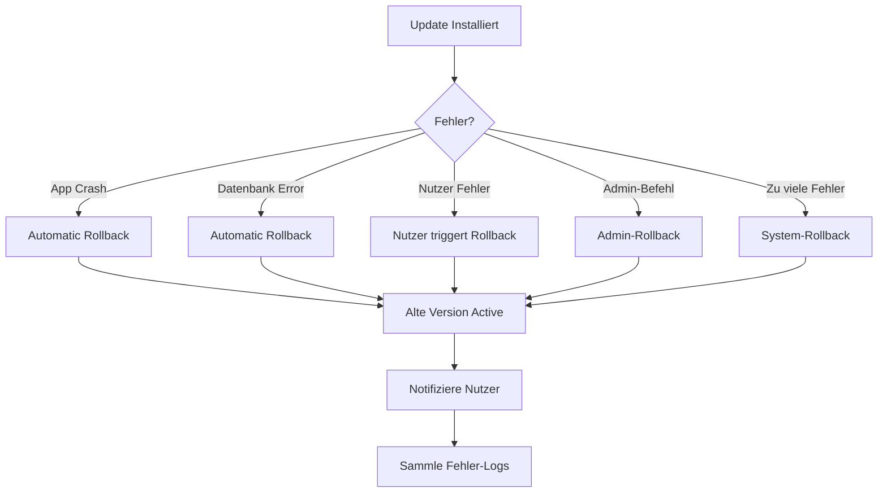
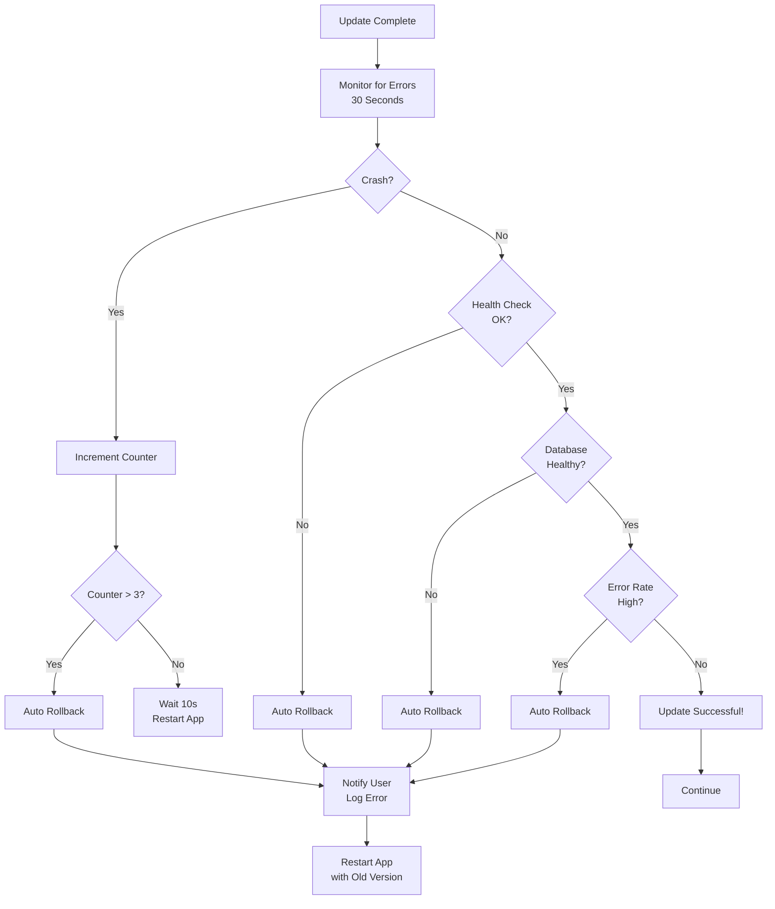

# 11 Rollback-Strategie & Fehlerbehandlung

## Überblick

Selbst beste Updates können fehlschlagen: Crashes, Datenbank-Fehler, Netzwerk-Probleme. Ein guter Rollback-Mechanismus macht Updates **rückgängig machbar**.

## Rollback-Trigger



## Automatisches Rollback

### Trigger 1: App Crash

```javascript
// Überwache Crashes nach Update
class CrashDetector {
  constructor() {
    this.crashCount = 0;
    this.checkInterval = 60 * 1000; // 1 Minute
    this.crashThreshold = 3;
  }
  
  startMonitoring() {
    process.on('uncaughtException', (error) => {
      this.crashCount++;
      console.error('Uncaught Exception:', error);
      
      // Log crash
      this.logCrash(error);
      
      // After 3 crashes in a row, rollback
      if (this.crashCount >= this.crashThreshold) {
        this.triggerRollback(error);
      }
    });
    
    // Reset counter every minute
    setInterval(() => {
      if (this.crashCount > 0 && this.crashCount < this.crashThreshold) {
        this.crashCount = 0;
      }
    }, this.checkInterval);
  }
  
  triggerRollback(error) {
    console.error('Too many crashes, initiating rollback...');
    
    // Disable new version flag
    preferences.setFlag('use_new_version', false);
    
    // Restore backup
    this.restoreBackup();
    
    // Notify user
    dialog.show({
      title: 'Rollback durchgeführt',
      message: 'Die neue Version hatte Fehler. ' +
               'Deine alte Version wurde wiederhergestellt.\n\n' +
               'Bitte kontaktiere den Support.',
      buttons: [
        {
          label: 'Support kontaktieren',
          onClick: () => openURL('https://example.com/support')
        }
      ]
    });
    
    // Restart app
    app.restart();
  }
  
  logCrash(error) {
    const crashLog = {
      timestamp: Date.now(),
      error: error.message,
      stack: error.stack,
      version: app.getVersion(),
      uptime: process.uptime()
    };
    
    sendToServer('/api/crashes', crashLog);
  }
}

const crashDetector = new CrashDetector();
crashDetector.startMonitoring();
```

### Trigger 2: Health Check Fails

```javascript
// Regelmäßig Datenbankzugriff testen
async function performHealthCheck() {
  try {
    const result = await database.query('SELECT 1');
    
    if (!result) {
      throw new Error('Database health check failed');
    }
    
    return { healthy: true };
  } catch (error) {
    console.error('Health check failed:', error);
    
    // Database ist kaputt, rollback!
    await triggerRollback('Database health check failed');
    return { healthy: false };
  }
}

// Run health check periodically
setInterval(performHealthCheck, 30 * 1000); // Every 30 seconds
```

### Trigger 3: Error Rate Threshold

```javascript
// Monitore Fehlerrate
class ErrorRateMonitor {
  constructor(errorThreshold = 5) {
    this.errors = [];
    this.errorThreshold = errorThreshold; // %
    this.windowSize = 60 * 1000; // 1 minute
  }
  
  recordError(error) {
    this.errors.push({
      timestamp: Date.now(),
      error
    });
    
    // Remove old errors (outside window)
    this.errors = this.errors.filter(
      e => Date.now() - e.timestamp < this.windowSize
    );
    
    // Check if threshold exceeded
    if (this.errors.length > 100) {
      const errorCount = this.errors.length;
      const errorRate = (errorCount / 100) * 100;
      
      if (errorRate > this.errorThreshold) {
        console.error(`Error rate ${errorRate}% exceeds threshold`);
        this.triggerRollback(`Error rate too high: ${errorRate}%`);
      }
    }
  }
  
  triggerRollback(reason) {
    // ... same as above
  }
}

const errorRateMonitor = new ErrorRateMonitor();
```

## Manuelles Rollback

### Nutzer-getriggert

```javascript
// Settings → Rollback Option
function showRollbackOption() {
  if (!hasBackup()) {
    dialog.show({
      title: 'Kein Rollback möglich',
      message: 'Es wurde kein Backup der alten Version erstellt.'
    });
    return;
  }
  
  dialog.show({
    title: 'Zur vorherigen Version zurückkehren?',
    message: `Diese Version: ${app.getVersion()}\n` +
             `Vorherige Version: ${getBackupVersion()}\n\n` +
             `Alle Daten seit dem Update werden gelöscht.`,
    buttons: [
      {
        label: 'Ja, zurückrollen',
        onClick: async () => {
          await performRollback();
          dialog.show({
            title: 'Rollback erfolgreich',
            message: 'App wird neu gestartet...'
          });
          app.restart();
        }
      },
      {
        label: 'Abbrechen',
        onClick: () => dialog.close()
      }
    ]
  });
}
```

### Admin-getriggert (Backend)

```bash
# Admin Panel oder CLI
POST /api/admin/rollback
{
  "deviceId": "abc123",
  "rollbackVersion": "2.0.0"
}

# Server
async function adminRollback(deviceId, rollbackVersion) {
  // 1. Validate admin authorization
  if (!isAdmin(req.user)) {
    return { error: 'Unauthorized' };
  }
  
  // 2. Check device exists
  const device = await Device.findById(deviceId);
  if (!device) {
    return { error: 'Device not found' };
  }
  
  // 3. Update manifest für dieses Device
  await DeviceManifest.update(
    { deviceId },
    { version: rollbackVersion, rollbackReason: 'Admin-triggered' }
  );
  
  // 4. Push notification an Device
  await pushNotification(deviceId, {
    title: 'Sicherheits-Update',
    body: 'Eine wichtige Sicherheitsversion steht bereit.',
    action: 'rollback'
  });
  
  // 5. Log action
  await AuditLog.create({
    admin: req.user.id,
    action: 'rollback',
    deviceId,
    rollbackVersion,
    timestamp: Date.now()
  });
  
  return { success: true };
}
```

## Rollback-Implementation

### Backup vor Update

```javascript
async function backupBeforeUpdate(manifest) {
  const currentPath = app.getInstallPath();
  const backupPath = `${currentPath}.backup.${Date.now()}`;
  
  console.log(`Backing up ${currentPath} → ${backupPath}`);
  
  try {
    // 1. Copy entire app directory
    await fs.promises.cp(currentPath, backupPath, {
      recursive: true,
      force: false  // Fail if backup exists
    });
    
    // 2. Also backup database (if applicable)
    const dbPath = app.getDatabasePath();
    const dbBackup = `${dbPath}.backup.${Date.now()}`;
    await fs.promises.cp(dbPath, dbBackup, { recursive: true });
    
    // 3. Store backup metadata
    await preferences.setBackupMetadata({
      version: app.getVersion(),
      timestamp: Date.now(),
      appPath: backupPath,
      dbPath: dbBackup,
      manifest
    });
    
    return backupPath;
  } catch (error) {
    console.error('Backup failed:', error);
    throw new Error('Could not backup - refusing to update');
  }
}
```

### Restore from Backup

```javascript
async function performRollback() {
  const metadata = await preferences.getBackupMetadata();
  
  if (!metadata) {
    throw new Error('No backup found');
  }
  
  console.log(`Restoring from backup...`);
  
  try {
    // 1. Stop running processes
    await app.stop();
    
    // 2. Restore app
    const currentPath = app.getInstallPath();
    const tempPath = `${currentPath}.old`;
    
    // Rename current → temp
    await fs.promises.rename(currentPath, tempPath);
    
    // Restore backup → current
    await fs.promises.cp(metadata.appPath, currentPath, {
      recursive: true,
      force: true
    });
    
    // 3. Restore database
    const dbPath = app.getDatabasePath();
    await fs.promises.rm(dbPath, { recursive: true });
    await fs.promises.cp(metadata.dbPath, dbPath, {
      recursive: true,
      force: true
    });
    
    // 4. Cleanup
    await fs.promises.rm(tempPath, { recursive: true });
    
    // 5. Reset flag
    await preferences.setFlag('use_new_version', false);
    
    // 6. Log rollback
    await logRollback({
      from: app.getVersion(),
      to: metadata.version,
      timestamp: Date.now(),
      reason: 'User/Auto-triggered'
    });
    
    console.log('Rollback successful');
    return true;
  } catch (error) {
    console.error('Rollback failed:', error);
    
    // TODO: Manual recovery steps?
    throw error;
  }
}
```

## Rollback Decision Tree



## Rollback Messaging

### Dialog für Nutzer

```javascript
function showRollbackNotification(reason) {
  const messages = {
    crash: {
      title: 'Update hatte Probleme',
      message: 'Die neue Version ist abgestürzt. ' +
               'Deine alte Version wurde wiederhergestellt.\n\n' +
               'Unser Team wurde benachrichtigt.',
      icon: 'warning'
    },
    database: {
      title: 'Datenbankfehler',
      message: 'Die Datenbank konnte nicht aktualisiert werden. ' +
               'Deine alte Version wird verwendet.\n\n' +
               'Support wurde kontaktiert.',
      icon: 'error'
    },
    errorRate: {
      title: 'Zu viele Fehler',
      message: 'Die neue Version hatte zu viele Fehler. ' +
               'Rollback wurde eingeleitet.',
      icon: 'warning'
    }
  };
  
  const msg = messages[reason] || messages.crash;
  
  dialog.show({
    title: msg.title,
    message: msg.message,
    icon: msg.icon,
    buttons: [
      {
        label: 'Support kontaktieren',
        onClick: () => openURL('https://example.com/support')
      },
      {
        label: 'OK',
        onClick: () => dialog.close()
      }
    ]
  });
}
```

## Database Rollback

**Für komplexe Migrationen müssen auch Datenbanken zurückrollen:**

```sql
-- Migration Version 3.0.0 (forward)
BEGIN TRANSACTION;

ALTER TABLE users ADD COLUMN email_normalized VARCHAR(255);
UPDATE users SET email_normalized = LOWER(email);
ALTER TABLE users ALTER COLUMN email_normalized SET NOT NULL;

-- If migration succeeds, commit
COMMIT;

-- If error, automatic:
ROLLBACK;

-- Rollback Version 3.0.0 (back to 2.1.0)
BEGIN TRANSACTION;

ALTER TABLE users DROP COLUMN email_normalized;

COMMIT;
```

**Versionierung im Code:**

```javascript
const migrations = {
  '2.1.0': {
    up: async (db) => {
      // forward
    },
    down: async (db) => {
      // backward
    }
  },
  '3.0.0': {
    up: async (db) => {
      // add column
    },
    down: async (db) => {
      // drop column
    }
  }
};

async function rollbackDatabase(fromVersion, toVersion) {
  const versionList = Object.keys(migrations)
    .sort()
    .reverse()
    .filter(v => semver.gt(v, toVersion) && semver.lte(v, fromVersion));
  
  for (const version of versionList) {
    await migrations[version].down(db);
  }
}
```

## Testing Rollback

```javascript
// Simulate various failures
describe('Rollback Scenarios', () => {
  test('should rollback on repeated crashes', async () => {
    // 1. Install new version
    await installUpdate('v2.1.0');
    
    // 2. Simulate 3 crashes
    app.crash();
    app.restart();
    app.crash();
    app.restart();
    app.crash();
    
    // 3. Verify rollback happened
    const version = app.getVersion();
    expect(version).toBe('v2.0.0');
  });
  
  test('should rollback on database error', async () => {
    await installUpdate('v2.1.0');
    
    // Corrupt database
    await fs.promises.writeFile(dbPath, 'corrupted');
    
    // App should detect error and rollback
    await app.start();
    const version = app.getVersion();
    expect(version).toBe('v2.0.0');
  });
  
  test('should allow manual rollback', async () => {
    await installUpdate('v2.1.0');
    expect(app.getVersion()).toBe('v2.1.0');
    
    // Trigger manual rollback
    await performRollback();
    
    expect(app.getVersion()).toBe('v2.0.0');
  });
});
```

## Monitoring & Alerting

```javascript
// Alert wenn zu viele Rollbacks
class RollbackMonitor {
  async check() {
    const recentRollbacks = await database.rollbackLog.find({
      timestamp: { $gte: Date.now() - 24 * 60 * 60 * 1000 }
    });
    
    if (recentRollbacks.length > 10) {
      // Alert team
      await slack.send({
        channel: '#alerts',
        text: `⚠️  ${recentRollbacks.length} rollbacks in last 24h`
      });
      
      // Disable auto-update
      await config.set('autoUpdateEnabled', false);
    }
  }
}

// Run check hourly
setInterval(() => rollbackMonitor.check(), 60 * 60 * 1000);
```

---

**Weiter:** Kapitel 12 (Testing-Workflow)
