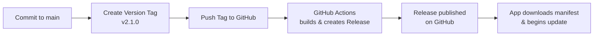

# 13 GitHub Integration & Automated Releases

## Überblick

GitHub bietet native Tools für Releases: Tags, Release-Notes, Binaries. Mit GitHub Actions kannst du deine komplette Release-Pipeline automatisieren.

## GitHub Releases erstellen

### Manuell (GUI)

1. Gehe zu **Releases** in deinem GitHub Repo
2. Click **"Create a new release"**
3. Trage **Tag-Name** ein: `v2.1.0`
4. Trage **Title** ein: `Version 2.1.0`
5. Schreibe **Release Notes** (Markdown)
6. Upload **Binaries** (Windows .exe, macOS .dmg, Linux .AppImage)
7. Click **"Publish release"**

### Via GitHub CLI

```bash
# Create and publish release
gh release create v2.1.0 \
  --title "Version 2.1.0" \
  --notes "Bug fixes and performance improvements" \
  app-2.1.0-windows.exe \
  app-2.1.0-macos.dmg \
  app-2.1.0-linux.AppImage

# Or from file
gh release create v2.1.0 \
  --notes-file RELEASE_NOTES.md \
  app-2.1.0-windows.exe

# List releases
gh release list

# Download release asset
gh release download v2.1.0 --pattern "*.exe"
```

## GitHub Actions Workflow

### Automatische Release bei Tag

```yaml
name: Release

on:
  push:
    tags:
      - 'v*'  # Trigger on version tags (v2.1.0, etc)

jobs:
  build:
    runs-on: ${{ matrix.os }}
    strategy:
      matrix:
        include:
          - os: windows-latest
            artifact: 'app-windows-x64.exe'
            build-cmd: 'npm run build:win'
          - os: macos-latest
            artifact: 'app-macos.dmg'
            build-cmd: 'npm run build:mac'
          - os: ubuntu-latest
            artifact: 'app-linux.AppImage'
            build-cmd: 'npm run build:linux'
    
    steps:
    - uses: actions/checkout@v2
    
    - name: Setup Node.js
      uses: actions/setup-node@v2
      with:
        node-version: '18'
    
    - name: Install dependencies
      run: npm ci
    
    - name: Build application
      run: ${{ matrix.build-cmd }}
    
    - name: Create checksum
      run: |
        sha256sum ./dist/${{ matrix.artifact }} > checksum.txt
    
    - name: Upload artifacts
      uses: actions/upload-artifact@v2
      with:
        name: ${{ matrix.artifact }}
        path: ./dist/${{ matrix.artifact }}
    
    - name: Upload checksum
      uses: actions/upload-artifact@v2
      with:
        name: checksums
        path: checksum.txt
  
  release:
    needs: build
    runs-on: ubuntu-latest
    
    steps:
    - uses: actions/checkout@v2
    
    - name: Download artifacts
      uses: actions/download-artifact@v2
      with:
        path: ./artifacts
    
    - name: Generate Release Notes
      id: release_notes
      run: |
        VERSION=${GITHUB_REF#refs/tags/}
        echo "version=${VERSION}" >> $GITHUB_OUTPUT
        
        # Extract changelog from CHANGELOG.md
        sed -n "/^## $VERSION/,/^## /p" CHANGELOG.md | head -n -1 > release_notes.txt
    
    - name: Create Release
      uses: softprops/action-gh-release@v1
      with:
        body_path: release_notes.txt
        files: |
          artifacts/app-windows-x64.exe/app-windows-x64.exe
          artifacts/app-macos.dmg/app-macos.dmg
          artifacts/app-linux.AppImage/app-linux.AppImage
          artifacts/checksums/*
        draft: false
        prerelease: false
      env:
        GITHUB_TOKEN: ${{ secrets.GITHUB_TOKEN }}
```

## Tag-basierte Releases

### Tagging-Strategie

```bash
# Create annotated tag (recommended)
git tag -a v2.1.0 -m "Release version 2.1.0" HEAD

# Or lightweight tag
git tag v2.1.0

# Push tags to GitHub
git push origin v2.1.0
# or push all tags
git push origin --tags

# List tags
git tag -l

# Delete local tag
git tag -d v2.1.0

# Delete remote tag
git push origin --delete v2.1.0
```

### Git Workflow



### Semantic Versioning in Git

```bash
#!/bin/bash
# release.sh - Create release tags

# Read version from package.json
VERSION=$(jq -r '.version' package.json)

# Create git tag
git tag -a "v${VERSION}" -m "Release version ${VERSION}"

# Push tag
git push origin "v${VERSION}"

echo "Created tag: v${VERSION}"
```

## Release-Notes aus Commits

### Automatic Changelog Generation

```bash
#!/bin/bash
# generate-changelog.sh

CURRENT_VERSION=$(git describe --tags --abbrev=0)
PREVIOUS_VERSION=$(git describe --tags --abbrev=0 $(git rev-list --tags --skip=1 --max-count=1))

echo "## ${CURRENT_VERSION}"
echo ""
echo "### Features"
git log ${PREVIOUS_VERSION}..${CURRENT_VERSION} --grep="^feat" --oneline

echo ""
echo "### Bug Fixes"
git log ${PREVIOUS_VERSION}..${CURRENT_VERSION} --grep="^fix" --oneline

echo ""
echo "### Breaking Changes"
git log ${PREVIOUS_VERSION}..${CURRENT_VERSION} --grep="^BREAKING" --oneline
```

### Conventional Commits

**Format:** `<type>(<scope>): <subject>`

```
feat(ui): add dark mode
  Dark mode now available in settings

fix(api): prevent memory leak
  Fixed connection pool not releasing memory

BREAKING CHANGE: API v1 endpoints removed
  Please migrate to v2 endpoints
```

**Parse mit Commitizen:**

```bash
# Install
npm install -g commitizen

# Make commits
git cz

# Generate changelog
conventional-changelog -p angular -i CHANGELOG.md -s
```

## Release Asset Management

### Windows .exe Upload

```yaml
- name: Build Windows EXE
  run: |
    npm run build:windows
    
- name: Sign Executable (Optional)
  run: |
    signtool sign \
      /f ${{ secrets.SIGNING_CERT_PATH }} \
      /p ${{ secrets.SIGNING_CERT_PASSWORD }} \
      dist/app-windows-x64.exe

- name: Create Installer
  run: |
    makensis setup.nsi  # NSIS installer
    
- name: Upload to Release
  uses: softprops/action-gh-release@v1
  with:
    files: |
      dist/app-windows-x64.exe
      dist/app-setup.exe
```

### macOS .dmg Upload

```yaml
- name: Build macOS DMG
  run: npm run build:mac
  
- name: Notarize DMG
  run: |
    xcrun notarytool submit dist/app-macos.dmg \
      --apple-id ${{ secrets.APPLE_ID }} \
      --password ${{ secrets.APPLE_PASSWORD }} \
      --team-id ${{ secrets.APPLE_TEAM_ID }}

- name: Staple Notarization
  run: xcrun stapler staple dist/app-macos.dmg

- name: Upload to Release
  uses: softprops/action-gh-release@v1
  with:
    files: dist/app-macos.dmg
```

### Linux .AppImage Upload

```yaml
- name: Build Linux AppImage
  run: npm run build:linux
  
- name: Generate Checksums
  run: |
    cd dist
    sha256sum app-linux.AppImage > app-linux.AppImage.sha256
    sha256sum app-linux.AppImage.zsync > app-linux.AppImage.zsync.sha256

- name: Upload to Release
  uses: softprops/action-gh-release@v1
  with:
    files: |
      dist/app-linux.AppImage
      dist/app-linux.AppImage.sha256
      dist/app-linux.AppImage.zsync
      dist/app-linux.AppImage.zsync.sha256
```

## Manifest-Datei hochladen

```yaml
- name: Generate Manifest
  id: manifest
  run: |
    node scripts/generate-manifest.js > manifest.json
    cat manifest.json

- name: Upload Manifest to Release
  uses: softprops/action-gh-release@v1
  with:
    files: manifest.json
    
- name: Publish Manifest to Server
  run: |
    curl -X POST https://updates.example.com/api/manifest \
      -H "Authorization: Bearer ${{ secrets.UPDATE_TOKEN }}" \
      -F "file=@manifest.json"
```

**manifest.json generieren:**

```javascript
// scripts/generate-manifest.js
const fs = require('fs');
const crypto = require('crypto');
const packageJson = require('../package.json');

const version = packageJson.version;
const assets = {
  windows: 'app-windows-x64.exe',
  macos: 'app-macos.dmg',
  linux: 'app-linux.AppImage'
};

const manifest = {
  appName: packageJson.name,
  latestVersion: version,
  minimumVersion: '1.5.0',
  releaseDate: new Date().toISOString(),
  changelog: readChangelog(version),
  platforms: {}
};

// For each platform, calculate hash and build manifest
for (const [platform, filename] of Object.entries(assets)) {
  const filepath = `./dist/${filename}`;
  const buffer = fs.readFileSync(filepath);
  const hash = crypto.createHash('sha256').update(buffer).digest('hex');
  
  manifest.platforms[platform] = {
    downloadUrl: `https://github.com/myorg/myapp/releases/download/v${version}/${filename}`,
    hash: `sha256:${hash}`,
    fileSize: buffer.length
  };
}

console.log(JSON.stringify(manifest, null, 2));

function readChangelog(version) {
  const content = fs.readFileSync('CHANGELOG.md', 'utf-8');
  const match = content.match(new RegExp(`## ${version}\\n([\\s\\S]*?)\\n## `, 'm'));
  return match ? match[1].trim() : '';
}
```

## Staging & Production Deployments

### Deploy to Staging

```yaml
- name: Deploy Manifest to Staging
  run: |
    curl -X POST https://staging-updates.example.com/api/manifest \
      -H "Authorization: Bearer ${{ secrets.STAGING_UPDATE_TOKEN }}" \
      -F "file=@manifest.json"
  
  - name: Test Update Flow in Staging
    run: npm run test:staging-update

  - name: Wait for Validation (24 hours)
    run: echo "Staging validation period started..."
```

### Promote to Production

```yaml
- name: Manual Approval Needed
  if: github.event_name == 'workflow_dispatch'
  run: echo "Promoting to production..."

- name: Deploy Manifest to Production
  run: |
    curl -X POST https://updates.example.com/api/manifest \
      -H "Authorization: Bearer ${{ secrets.PROD_UPDATE_TOKEN }}" \
      -F "file=@manifest.json"

- name: Announce Release
  run: |
    curl -X POST https://slack.example.com/webhook \
      -d '{"text":"Release v${VERSION} is live"}' \
      -H "Content-Type: application/json"
```

## Automated Testing of Releases

```yaml
- name: Download Release & Test
  run: |
    # Download from release
    gh release download v${VERSION} --pattern "*.exe"
    
    # Verify hash
    sha256sum -c checksum.txt
    
    # Test installation (in sandbox)
    wine app-windows-x64.exe /S
    
    # Verify update check works
    npm run test:update-check -- v${VERSION}
```

## Release Checkliste

```markdown
## Pre-Release Checklist

### Code Quality
- [ ] All tests passing (unit, integration, e2e)
- [ ] Code review approved
- [ ] No security vulnerabilities (npm audit)
- [ ] Bundle size optimized

### Versioning
- [ ] Version bumped in package.json
- [ ] Git tag created (v2.1.0)
- [ ] Changelog updated

### Build & Assets
- [ ] Windows .exe built & signed
- [ ] macOS .dmg built & notarized
- [ ] Linux .AppImage built
- [ ] All checksums calculated (SHA256)
- [ ] Manifests generated & validated

### Release
- [ ] GitHub Release created
- [ ] Binaries uploaded
- [ ] Release notes published
- [ ] Manifest published to update server

### Testing
- [ ] Staging update tested (24h)
- [ ] All platforms tested
- [ ] Rollback path tested
- [ ] Smoke tests passing

### Post-Release
- [ ] Announced on changelog page
- [ ] Social media notified
- [ ] Monitoring active (error rates, updates)
- [ ] Support team informed
```

---

**Weiter:** Kapitel 14 (Agent-Workflow)
